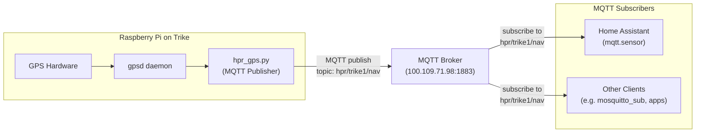

# HPR GPS Telemetry System — Production As-Built & Runbook

## Overview

Complete production description of the HPR GPS telemetry system. A new engineer can build, operate, and troubleshoot the system from scratch using this document.

**Pipeline:**
```
GPS (u-blox NEO-M9N) → gpsd → hpr_gps.py → MQTT → Home Assistant / gps_bridge.py → WebSocket → 3D Viewer
```

---

## Hardware

- Raspberry Pi 4 (2GB+)
- u-blox NEO-M9N GPS
- Active GPS antenna (correct connector required)
- Network via WiFi / Tailscale

---

## GPS Configuration

Set GPS to 10Hz:

```sh
ubxtool -p CFG-RATE,100,1
ubxtool -p SAVE
```

Validate:

```sh
gpspipe -w
# cycle: 0.10
```

---

## Files

| File | Deployed path | Purpose |
|------|--------------|---------|
| `gps/hpr_gps.py` | `/opt/hpr/hpr_gps.py` | GPS → MQTT publisher |
| `gps/hpr-gps.service` | `/etc/systemd/system/hpr-gps.service` | systemd service unit |
| `gps/home_assistant_mqtt.yaml` | HA `configuration.yaml` | MQTT sensor config |

---

## Deployment

### 1. Install dependencies

```sh
pip3 install paho-mqtt gps
```

### 2. Deploy script

```sh
sudo cp gps/hpr_gps.py /opt/hpr/hpr_gps.py
```

### 3. Install and enable service

```sh
sudo cp gps/hpr-gps.service /etc/systemd/system/hpr-gps.service
sudo systemctl daemon-reload
sudo systemctl enable hpr-gps.service
sudo systemctl start hpr-gps.service
```

### 4. Add Home Assistant sensor

Merge `home_assistant_mqtt.yaml` into your HA `configuration.yaml`, then restart Home Assistant.

---

## Validation Procedure

1. `systemctl status hpr-gps.service` — must be **running**
2. `mosquitto_sub -h <MQTT_HOST> -t hpr/trike1/nav` — confirm data flowing
3. HA MQTT listener — confirm messages arriving
4. HA sensor — confirm numeric speed value

---

## Troubleshooting

**No data in HA:**
- Check `mosquitto_sub` output
- If empty: script is not running

**Service fails to start:**
- `journalctl -u hpr-gps.service`
- Look for network errors

**errno 113 (No route to host):**
- Network not ready at startup
- Script has retry logic; check Tailscale / WiFi connectivity

**Dot not moving in 3D viewer:**
- Duplicate publishers on the same MQTT topic
- Stale browser cache — hard refresh

---

## Future Enhancements

- Heading-based rotation
- Camera follow mode
- Multi-trike support
- Logging + replay
- Race analytics

